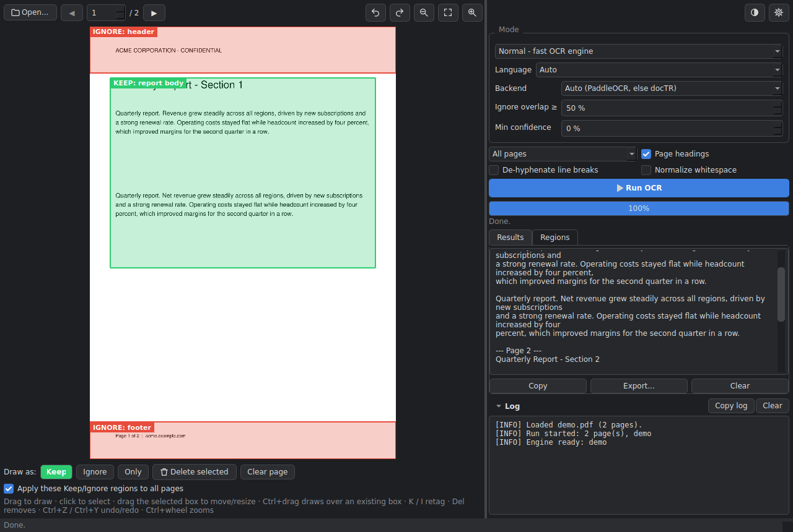
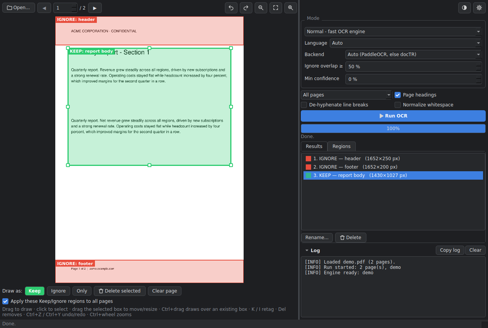
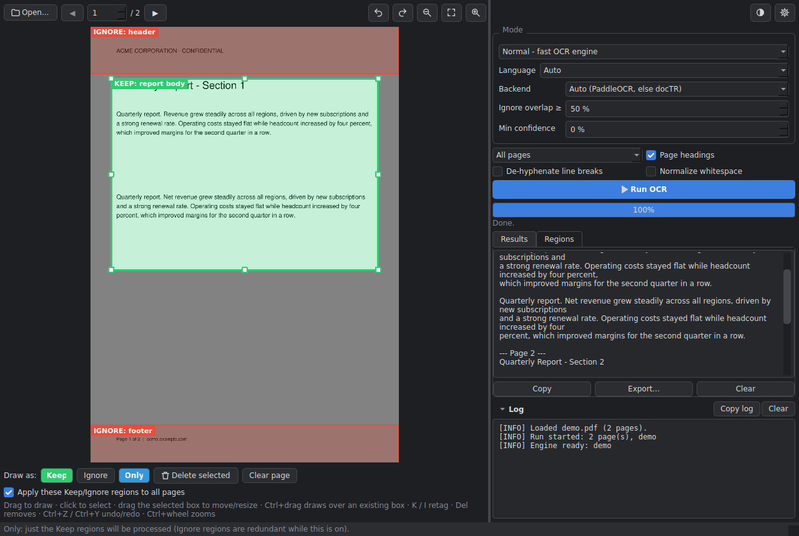
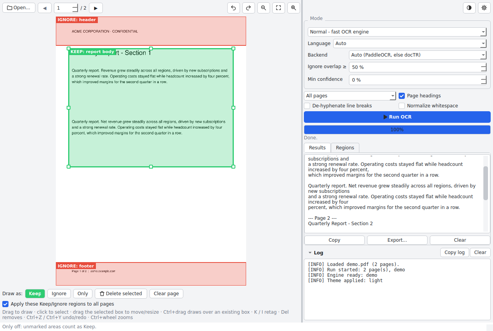
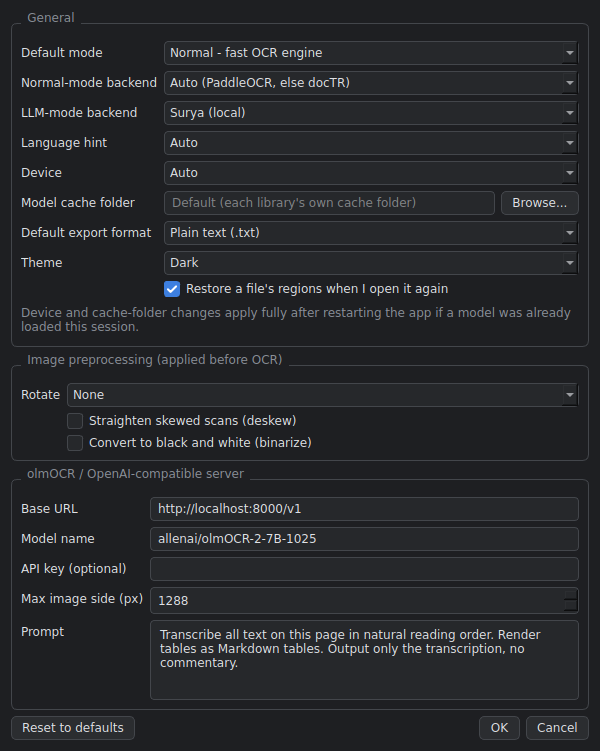

# OcuRead

**OcuRead: a fast, flexible OCR reader with Normal and LLM modes.**

Drop in a PDF or image, mark the areas that matter (or the ones to skip), and read the text out with either a
fast traditional engine (PaddleOCR / docTR) or a vision-language model (Surya, or olmOCR / any OpenAI-compatible server).



<sub>Screenshots use a stand-in engine that reads the demo PDF's own text layer, so they can be produced without downloading OCR models. The real engines run the same code path.</sub>

---

## 1. Installation

Requires **Python 3.10 or newer**. **Python 3.12 is recommended**: PaddlePaddle and PyTorch publish wheels for new Python
releases late (3.13/3.14 currently have no `paddlepaddle` wheel). A separate venv keeps things tidy:

```powershell
py -3.12 -m venv venv
.\venv\Scripts\Activate.ps1
pip install -r requirements.txt
```

Notes on the pins in `requirements.txt`:

- **`transformers<5.0`** - Surya breaks on transformers 5.x (errors mentioning `pad_token_id`).
- **`surya-ocr<0.20`** - Surya 0.20+ (v2) replaced the predictor API that OcuRead's Surya backend uses. The "olmOCR / OpenAI-compatible server" backend has no such restriction.
- **`paddlepaddle==3.2.2`** - 3.3.x has a CPU-inference bug (`ConvertPirAttribute2RuntimeAttribute ...`).
- **docTR** is optional: `pip install "python-doctr[torch]"`.

**PyTorch / CUDA.** `pip` installs the CPU build of PyTorch by default on Windows. For an NVIDIA GPU, install the CUDA build first, following
the selector at <https://pytorch.org/get-started/locally/>, then `pip install -r requirements.txt`. For PaddleOCR on GPU use `paddlepaddle-gpu` instead of `paddlepaddle`.

**First run.** Models download the first time an engine is used (progress shows in the bar and the log pane). Point the downloads at another drive under
**Settings > Model cache folder**.

## 2. Run

```powershell
python main.py               # or:  python main.py path\to\file.pdf
.\run.bat                    # runs the built .exe if there is one, otherwise python main.py  (run.bat --dev forces source)
```

Want a double-clickable `.exe`? See [Building a Windows executable](#7-building-a-windows-executable).

## 3. Project structure

```
OcuRead/
├── main.py                  # Thin entry point: creates QApplication, hands over to App
├── app.py                   # App: composition root - builds config, theme, logging, engines, sessions, exporter
├── requirements.txt
├── README.md
├── ocuread.spec             # PyInstaller spec (icon, hidden imports, data files, debug / one-file switches)
├── build.bat                # One-command Windows build   (--debug  --clean  --onefile)
├── run.bat                  # Launch the built exe, or run from source
├── tools/
│   ├── make_icon.py         # icon.png -> icon.ico (and a placeholder icon if none is supplied)
│   └── spec_helpers.py      # Helpers for ocuread.spec (dependency-metadata collection)
├── config/
│   ├── defaults.py          # Default value for every setting + the option lists the UI offers
│   └── manager.py           # ConfigManager: load / validate / migrate / save config.json
├── ui/
│   ├── main_window.py       # MainWindow: wires panels together, runs OCR, sessions, export
│   ├── preview_widget.py    # PreviewWidget: page navigation, zoom, Keep/Ignore/Only tools
│   ├── region_canvas.py     # RegionCanvas: draws the page and handles region mouse/keyboard editing
│   ├── region.py            # RegionStore: per-page regions, shared template, Only flag
│   ├── region_list.py       # Sidebar list of regions (select / rename / delete)
│   ├── options_panel.py     # Mode, backend, language, run scope, Run / Cancel button
│   ├── results_panel.py     # Text output + Copy / Export / Clear
│   ├── progress_panel.py    # Unified progress bar
│   ├── log_pane.py          # Collapsible log viewer
│   ├── settings_dialog.py   # SettingsDialog (gear icon)
│   ├── error_dialog.py      # Friendly error dialog with "Copy traceback"
│   ├── pipeline_worker.py   # QThread adapter: core callbacks -> Qt signals
│   └── widgets.py           # Small combo-box helpers
├── theme/
│   ├── dark.qss, light.qss  # Stylesheets
│   └── theme_manager.py     # ThemeManager: applies QSS + palette, tints icons, persists the choice
├── core/                    # No Qt, no UI imports - can be used (and tested) headless
│   ├── models.py            # Dataclasses: Region, TextBox, OCRResult, PageJob, RunOptions, PreprocessOptions
│   ├── ocr_engine.py        # Abstract base class OCREngine
│   ├── engines/
│   │   ├── normal_engine.py # NormalEngine: PaddleOCR / docTR
│   │   ├── llm_engine.py    # LLMEngine: Surya / olmOCR (OpenAI-compatible server)
│   │   └── __init__.py      # EngineSpec + EngineFactory (builds and caches engines)
│   ├── pipeline.py          # OCRPipeline: load -> mask/preprocess -> engine -> post-process, per page
│   ├── preprocessing.py     # Ignore/Only masks, rotate, deskew, binarize
│   ├── postprocessing.py    # Confidence filter, line assembly, de-hyphenation, whitespace
│   ├── progress.py          # Stage-weighted ProgressTracker + TqdmBridge (silences tqdm, reports to the bar)
│   ├── languages.py, devices.py, model_cache.py
├── fileio/                  # (called "io" in the original brief - see note below)
│   ├── file_loader.py       # FileLoader: PDF/image/multi-page TIFF -> page images
│   ├── exporter.py          # Exporter: .txt / .md / .json / annotated PDF
│   └── session_store.py     # SessionStore: regions remembered per file
├── utils/
│   ├── paths.py             # appdata_dir(), config_path(), sessions_dir(), logs_dir(), cache_dir()
│   └── logger.py            # LogManager: rolling log file
└── assets/
    ├── icon.png, icon.ico   # Application icon (window / taskbar / exe)
    └── icons/               # SVG toolbar icons (tinted per theme at run time)
```

> **Why `fileio/` and not `io/`?** A top-level package called `io` collides with Python's built-in `io` module, so `import io`
> would break. Same layout, safe name.

## 4. Configuration

Everything lives in one per-user folder:

| OS | Location |
|---|---|
| Windows | `%APPDATA%\OcuRead\` |
| macOS | `~/Library/Application Support/OcuRead/` |
| Linux | `$XDG_CONFIG_HOME/OcuRead/` or `~/.config/OcuRead/` |

(Set the `OCUREAD_HOME` environment variable to use a different folder.)

| Item | What it is |
|---|---|
| `config.json` | Your settings: mode, backends, language, device, theme, export format, model cache folder, preprocessing, server details. Written atomically; missing keys fall back to defaults; a corrupt file is renamed `config.json.bad` and defaults are used. |
| `sessions/` | One small JSON per file you opened, holding its regions (restored when you open the file again; toggle in Settings). Ignored automatically if the file's size or page count changed. |
| `logs/` | `ocuread.log`, rotating (1 MB x 5). |
| `cache/` | Scratch space owned by OcuRead. Models stay in each library's own cache (Hugging Face, PaddleX ...) unless you set **Model cache folder**. |

On first launch OcuRead imports settings from the previous single-file app ("OCR Studio") if it finds them.

## 5. Features

- [x] Drag-and-drop PDF / image input (also **Open...**, and `python main.py file.pdf`)
- [x] Two modes: **Normal** (PaddleOCR / docTR) and **LLM** (Surya / olmOCR server)
- [x] Preview with **Keep / Ignore / Only** region drawing - move, resize, retag (K / I), delete, right-click menu
- [x] **Only** toggle: when on, only Keep regions are processed (everything else is dimmed on the page)
- [x] "Apply these regions to all pages" (regions are stored as page fractions, so different page sizes work)
- [x] Unified progress bar: layout detection + recognition + assembly combined, with a stage label and elapsed time - no raw tqdm output
- [x] Settings dialog (gear): mode, backends, language, device, theme, cache folder, export format, preprocessing, server
- [x] Dark and light themes (QSS), one-click toggle, remembered
- [x] Cancel button during OCR (stops after the current page)
- [x] Zoom / fit controls (also Ctrl+wheel)
- [x] Region sidebar list (Regions tab): select, rename, delete
- [x] Undo / redo for region edits (Ctrl+Z / Ctrl+Y)
- [x] Copy / Export / Clear
- [x] Export: `.txt`, `.md`, `.json` (per-page text + line boxes + confidence) and **annotated PDF** (Keep outlined, Ignore blacked out)
- [x] Preprocessing: rotate, deskew, binarize (Settings) - regions still line up
- [x] Post-processing: confidence filter, de-hyphenation, whitespace normalisation
- [x] Friendly error dialog with **Copy traceback**
- [x] `transformers<5.0` pinned in `requirements.txt`
- [x] Custom application icon (window, taskbar, executable) and a one-command Windows build



| Only mode | Light theme | Settings |
|---|---|---|
|  |  |  |

## 6. Troubleshooting

- **Surya fails with `pad_token_id` errors** - transformers 5.x is installed. `pip install "transformers<5.0"`.
- **"Couldn't import the Surya 1.x API"** - Surya 0.20+ is installed. `pip install "surya-ocr<0.20" "transformers<5.0"`, or use the server backend.
- **`ConvertPirAttribute2RuntimeAttribute ... not support` from PaddleOCR** - PaddlePaddle 3.3.x bug: `pip install paddlepaddle==3.2.2`.
- **No `paddlepaddle` wheel / install fails** - you're on a very new Python. Create the venv with Python 3.12.
- **GPU not detected** - the log pane says what happened (e.g. "CUDA isn't available in this PyTorch install; using CPU"). Install the CUDA build of PyTorch (see Installation); for Paddle use `paddlepaddle-gpu`. Device *Auto* uses the library default.
- **Where are the models?** - by default in each library's own cache (`~/.cache/huggingface`, `~/.paddlex`, ...). Change it in Settings > Model cache folder; if a model was already loaded this session, restart the app for it to take effect.
- **tqdm bars in the console** - OcuRead silences them while an engine runs and feeds them into the progress bar. Anything else goes to `logs/ocuread.log` and the log pane.
- **Something odd?** - open the **Log** pane (bottom right) or `logs/ocuread.log`. Error dialogs have a **Copy traceback** button.
- **Settings look wrong after an upgrade** - delete `config.json`; it is recreated with defaults.

## 7. Building a Windows executable

### Building from source

**Prerequisites:** Windows 10/11 (64-bit), Python **3.12** on `PATH` (3.10-3.12 work), the
[Microsoft Visual C++ Redistributable](https://learn.microsoft.com/cpp/windows/latest-supported-vc-redist) (torch/paddle need it),
an internet connection for the first install, and roughly 10 GB of free disk (venv + PyTorch + Paddle + build output).
For NVIDIA GPU support in the built app, install the CUDA build of PyTorch into the venv *before* building (the exe ships whatever torch is installed at build time).

**One command:**

```powershell
.\build.bat
```

It prints a header, checks Python, creates/activates `venv` (preferring Python 3.12), runs `pip install -r requirements.txt`, installs PyInstaller if missing,
makes `assets\icon.ico` if needed, and runs `pyinstaller --clean --noconfirm ocuread.spec`. The full PyInstaller output goes to `build_log.txt`;
if anything fails the window stays open and shows the last lines of that log.

| Command | Result |
|---|---|
| `build.bat` | Windowed build, one folder -> `dist\OcuRead\OcuRead.exe` |
| `build.bat --debug` | Console window on (you see logs and tracebacks), no UPX -> `dist\OcuRead-debug\OcuRead-debug.exe` |
| `build.bat --clean` | Deletes `build\` and `dist\` first |
| `build.bat --onefile` | Single `dist\OcuRead.exe` (slower start: it unpacks GBs to a temp folder each launch) |

Flags combine (`build.bat --clean --debug`). Test the result with **`run.bat`** (`run.bat --debug` runs the debug build).

### Icon customization

The icon lives in `assets/`: `icon.png` (cross-platform, 512x512 with transparent corners) and `icon.ico` (Windows, 16-256 px).
To use your own: **replace `assets/icon.png`** (square, at least 256x256) and run `build.bat` - it regenerates `icon.ico` when the PNG is newer
(or run `python tools\make_icon.py --force`). If `icon.png` is missing altogether, a simple document-and-magnifier placeholder is generated.

The icon is used in three places: the `.exe` file itself (`icon='assets/icon.ico'` in `ocuread.spec`), the window title bar, and the taskbar
(`App` calls `setWindowIcon` and, on Windows, sets an explicit AppUserModelID so the taskbar doesn't show Python's icon when running from source).
Windows caches exe icons aggressively: if you still see the old one, rename the exe or clear the icon cache.

### Spec file notes

- **Hidden imports.** The engines import PaddleOCR, docTR, Surya and torch lazily, and those libraries load submodules dynamically, so PyInstaller's static analysis misses parts of them.
  `ocuread.spec` lists them and calls `collect_submodules` / `collect_data_files` for Surya, PaddleOCR, PaddleX, docTR, transformers and tokenizers so model/pipeline configs ship inside the build.
  Packages that aren't installed are skipped with a note, so an optional backend you didn't install causes no errors.
- **Package metadata.** Libraries check their own dependencies with `importlib.metadata` at run time: PaddleX verifies the extras of `paddlex[ocr]` (opencv, pyclipper, shapely ...), and transformers finds out whether PyTorch exists by reading torch's version. That metadata isn't in a frozen app unless bundled, so the spec walks the dependency tree of `METADATA_ROOTS` (extras included, via `tools/spec_helpers.py`) and copies the metadata of everything installed.
- **Data files.** `assets/` (icons) and `theme/` (`.qss` stylesheets) are bundled; at run time `utils.paths.project_root()` finds them inside the build.
- **UPX is off** everywhere - it corrupts torch/CUDA DLLs. **Console** is off for the normal build and on for `--debug`.
- **One-folder vs one-file.** One-folder is the default because it starts fast. For one-file use `build.bat --onefile`, or set `ONEFILE = True` in the spec to make it permanent.
- **Adding a new backend** (see *Adding a new engine* below): (1) write the engine; (2) add its Python package to `OPTIONAL_PACKAGES` in `ocuread.spec` (and to the lazy-import list next to it);
  (3) add its pip name to `METADATA_ROOTS` (its dependencies are picked up automatically); if it loads a compiled library by file path, also add `binaries += native_libraries("pkg")`; (4) add the pip requirement to `requirements.txt`; (5) rebuild with `--debug` and run a page through it - a missing import shows as a traceback in the console.

### Troubleshooting the build

- **`build.bat` says Python isn't found / prints a Microsoft Store message** - install Python from python.org and tick "Add python.exe to PATH" (or disable the Store "app execution alias" for python).
- **`ModuleNotFoundError` / `ImportError` only in the built exe** - a dynamic import wasn't detected. Build with `--debug`, read the traceback, add the module to `hiddenimports` (or the package to `OPTIONAL_PACKAGES`), rebuild.
- **`DependencyError: `OCR` requires additional dependencies` / `A dependency error occurred during pipeline creation` (PaddleOCR, built exe only)** - PaddleX couldn't see its dependencies' metadata. Fixed in the spec by `METADATA_ROOTS`; rebuild with `build.bat --clean`. If it persists, check the deps are installed in the venv: `pip install "paddlex[ocr-core]"`.
- **`RuntimeError: operator torchvision::nms does not exist` (docTR or Surya)** - torchvision's compiled library wasn't loaded. Two causes: (1) *built exe only* - the spec now bundles it (`native_libraries("torchvision")`); rebuild with `build.bat --clean`. (2) *also fails from source* (`python main.py`) - torch and torchvision versions don't match; fix with `pip install --force-reinstall torch torchvision` (use the same index/CUDA variant for both, see pytorch.org) and check `pip list` shows matching versions.
- **`PackageNotFoundError: No package metadata was found for X`** (or a library claiming a dependency like PyTorch is missing) - add `X`'s parent package to `METADATA_ROOTS` in the spec and rebuild with `--clean`.
- **Missing DLLs (`WinError 126`, `c10.dll`, `VCRUNTIME140...`)** - install the latest Visual C++ Redistributable (x64). On the build machine, make sure only one torch is installed in the venv.
- **torch / CUDA mismatch** (`Torch not compiled with CUDA enabled`, or the CPU build got installed) - install the CUDA build of PyTorch from pytorch.org *first*, then `pip install -r requirements.txt`, then `build.bat --clean`. The exe uses the torch that was in the venv at build time.
- **UPX corruption** (app crashes on start, "Failed to load python DLL") - UPX is disabled in the spec; if you re-enabled it, turn it off again and rebuild with `--clean`.
- **Stale results after changing the spec or the icon** - `build.bat --clean`.
- **`PermissionError` while writing `dist\`** - the exe is still running, or antivirus is scanning it. Close the app, wait, retry.
- **Antivirus flags the exe** - unsigned PyInstaller builds are a common false positive; sign the exe or add an exclusion.
- **Warnings such as `Hidden import "pycparser.lextab" not found`** - come from PyInstaller's own hooks and are harmless.
- **The window opens and closes / nothing happens** - run the `--debug` build from a terminal; the error is printed there. Logs are also in `%APPDATA%\OcuRead\logs\ocuread.log`.

### Distribution

- **What to ship:** the whole `dist\OcuRead\` folder (zip it and keep the folder structure - the exe needs the `_internal` folder next to it). With `--onefile`, just `dist\OcuRead.exe`.
  Don't ship `build\`, `venv\`, `build_log.txt`, or the `-debug` build. Users need no Python installed.
- **Size (rough estimates, not measured on Windows):** the GUI alone - PySide6, PyMuPDF, Pillow, no ML libraries - measured about 435 MB on Linux. Adding the ML stack typically brings the folder to a few GB (roughly 2-4 GB with CPU-only PyTorch + PaddlePaddle); a CUDA build of PyTorch adds several GB more. Zipped, expect roughly half.
- **Models are not bundled.** They download on first use (PaddleOCR, Surya and docTR each fetch their own weights) into the normal Hugging Face / PaddleX caches, or into **Settings > Model cache folder**. The first run therefore needs internet;
  for offline machines, run once on a connected machine and copy the cache folder, then point Settings at it.
- **User data stays out of the install folder** (`%APPDATA%\OcuRead\`), so replacing the app folder with a newer build keeps settings and saved regions.
- The exe is unsigned, so Windows SmartScreen may warn on first launch ("More info" > "Run anyway") until you sign it.

### Deliverables checklist

- [x] `assets/icon.ico` and `assets/icon.png` present
- [ ] `ocuread.spec` builds without warnings about missing modules (verify with your full install)
- [ ] `build.bat` produces a runnable `dist\OcuRead\OcuRead.exe` on a clean Windows machine
- [ ] Icon appears on the exe, in the taskbar, and in the window title bar
- [ ] `run.bat` launches the app for quick testing
- [x] README documents prerequisites, the one-command build, the output location, and how to add a new backend (which requires updating the spec's hidden imports)

## 8. Architecture overview

**UI vs. core.** `core/`, `fileio/`, `config/` and `utils/` never import Qt or `ui/`. The UI depends on the core, never the other way round.
That's why the whole OCR pipeline runs (and is tested) without a display.

**Composition root.** `main.py` creates the `QApplication` and an `App`. `App` builds the long-lived services - `ConfigManager`,
`ThemeManager`, `LogManager`, `EngineFactory`, `SessionStore`, `Exporter` - once and passes them down. There is no global state
(the one unavoidable exception is tqdm's class-level hook, which `TqdmBridge` confines to the duration of a run).

**Signal / slot flow of a run.**

```
OptionsPanel.runClicked ─▶ MainWindow.on_run_clicked
      builds EngineSpec ─▶ EngineFactory.create ─▶ OCREngine
      builds PageJobs (regions per page) + RunOptions ─▶ OCRPipeline
      PipelineWorker(QThread).start()
          OCRPipeline.run(...)                      (background thread, pure Python)
            ├─ progress callback ─▶ PipelineWorker.progress(ProgressUpdate) ─▶ ProgressPanel
            └─ result callback   ─▶ PipelineWorker.resultReady(OCRResult)   ─▶ ResultsPanel
          on finish / error      ─▶ PipelineWorker.ended(status) / failed(msg, traceback)
Cancel ─▶ PipelineWorker.cancel ─▶ OCRPipeline.cancel ─▶ OCREngine.cancel
```

**Per page inside the pipeline:** render page ─▶ (if rotate/deskew is on: blank ignored areas first so regions still line up) ─▶ preprocess ─▶
`engine.run(image, regions, options)` ─▶ `PostProcessor` (confidence filter, line assembly, de-hyphenation, whitespace).
Normal engines drop boxes that overlap ignored areas; LLM engines get the ignored areas painted white.

**Adding a new engine** - subclass `OCREngine`:

```python
from core.ocr_engine import OCREngine
from core.models import OCRResult, TextBox

class MyEngine(OCREngine):
    label = "My engine"

    def prepare(self) -> None:                      # load models; raise RuntimeError with a helpful message on failure
        self.model = load_my_model()

    def run(self, image, regions, options) -> OCRResult:
        self.report("ocr", None)                    # optional: drives the progress bar ("detect", "recognize", "ocr", "model")
        boxes = [TextBox(x0, y0, x1, y1, text, confidence), ...]   # or return OCRResult(text="...") if you have no boxes
        return OCRResult(boxes=boxes)               # respect options.only / regions via core.preprocessing helpers
```

Then make the app build it: add a branch in `EngineFactory.create` (`core/engines/__init__.py`) - or call
`factory.register(spec, MyEngine())` - and add its name to the option lists in `config/defaults.py` so it appears in the UI.

## 9. Roadmap

- Batch / folder mode
- Region templates with per-page overrides (today: one region set per page, or one shared set for all pages)
- Recent files list
- Search inside results; side-by-side page/text highlighting
- Real cancellation of an in-flight model call (today Cancel takes effect after the current page)
- Code-signed installer (Inno Setup / MSIX) on top of the PyInstaller build

## 10. Credits & license

OcuRead stands on: [Surya](https://github.com/datalab-to/surya), [PaddleOCR](https://github.com/PaddlePaddle/PaddleOCR),
[docTR](https://github.com/mindee/doctr), [olmOCR](https://github.com/allenai/olmocr), [PyMuPDF](https://github.com/pymupdf/PyMuPDF),
[PySide6 / Qt for Python](https://doc.qt.io/qtforpython-6/), Pillow and NumPy.